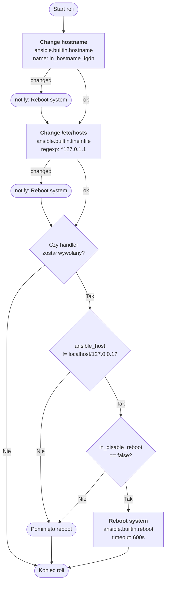

#  set-hostname

Rola Ansible do ustawiania hostname'u serwera, aktualizacji wpisu 127.0.1.1 w `/etc/hosts`. Obsługuje systemy Debian, Ubuntu, AlmaLinux (EL 7/8/9) oraz Alpine.

---

## Co robi rola

- ustawia hostname na wartość FQDN lub krótki hostname (moduł `hostname`)
- aktualizuje wpis `127.0.1.1` w `/etc/hosts` — gdy nazwa zawiera kropkę, FQDN jest wpisywany jako pierwszy (zgodnie z konwencją `man hosts`), a krótki hostname jako alias
- opcjonalnie wymusza restart maszyny po zmianie (można wyłączyć)

---

## Architektura roli set-hostname

### Flow procesu



### Opis kroków

| Krok | Moduł | Opis |
|------|-------|------|
| Change hostname | `ansible.builtin.hostname` | Ustawia hostname na wartość `in_hostname_fqdn` |
| Change /etc/hosts | `ansible.builtin.lineinfile` | Aktualizuje wpis `127.0.1.1` — dla FQDN wpisuje pełną nazwę + alias krótki |
| Reboot system | `ansible.builtin.reboot` | Restartuje maszynę (timeout 600s), pomijany dla localhost i gdy `in_disable_reboot: true` |


## Wymagania

- Ansible 2.9+
- dostęp z uprawnieniami root (np. `become: true`)

---

## Zmienne

| Zmienna                          | Domyślna wartość           | Opis |
|----------------------------------|----------------------------|------|
| `in_hostname_fqdn`               | `{{ inventory_hostname }}` | Docelowy hostname/FQDN. Gdy zawiera kropkę, wpis w `/etc/hosts` zawiera hostname i FQDN. |
| `in_disable_reboot`              | `false`                    | `true` wyłącza reboot po zmianie hostname'u lub wpisu w `/etc/hosts`. |

---

## Użycie

Podstawowy playbook ustawiający hostname i wpis w `/etc/hosts`:

```yaml
- hosts: all
  become: true
  roles:
    - role: set-hostname
      vars:
        in_hostname_fqdn: app01.example.com
        in_disable_reboot: true  # pominie restart po zmianie
```

Zmiana hostname'u i wpisu w `/etc/hosts` wywołuje handler `Reboot system`. Jeśli chcesz uniknąć restartu (np. w środowisku testowym), ustaw `in_disable_reboot: true`.

---

## Contributions

Jeśli masz pomysły na ulepszenia, zgłoś problemy, rozwidl repozytorium lub utwórz Merge Request. Wszystkie wkłady są mile widziane!
[Contributions](CONTRIBUTING.md)

---

## License

[Licencja](LICENSE) oparta na zasadach Creative Commons BY-NC-SA 4.0, dostosowana do potrzeb projektu.

---

## Author Information

|  |
|------------------------------------------------------------------------------------------------|
| [Maciej Rachuna](https://gitlab.commrachuna)                                                   |
